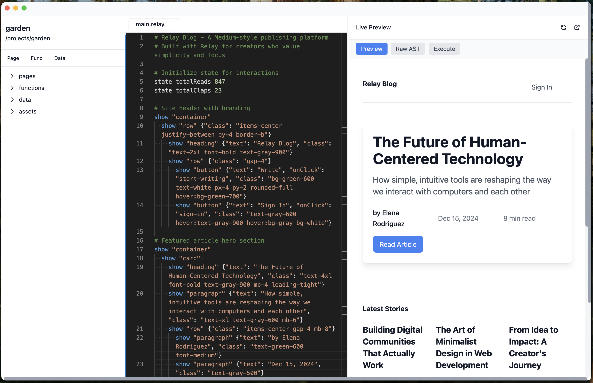

# Relay Desktop

**Web Development for Everyone - Breaking Corporate Control of the Web**

Relay Desktop is more than a development environment - it's a tool for digital independence. We're building technology that puts the power of web creation back into the hands of individuals, communities, and small organizations.

## The Problem We're Solving

The web has been captured. What started as a decentralized network for sharing human knowledge has become a handful of walled gardens controlled by mega-corporations. Building dynamic websites has become the exclusive domain of well-funded corporations and technical elites.

Meanwhile, we've lost the magic of the early web - where anyone could create an HTML file, add some logic, and have a working dynamic website. The barrier to entry has grown so high that millions of potential creators, communities, and independent voices have been pushed to the sidelines.

## The Relay Solution

Relay brings back the simplicity of early web development while embracing modern capabilities. It's designed to break the corporate stranglehold on web development by making it accessible to everyone, not just venture-funded startups and Fortune 500 companies.

### Who This Is For

- **Local Libraries** who want to catalog books without paying subscription fees to corporate platforms
- **Neighborhood Groups** organizing events without surrendering data to social media giants
- **Independent Artists** selling work without platform fees eating their profits
- **Small Nonprofits** building tools without enterprise software budgets
- **Student Organizations** creating websites without IT department approval
- **Hobby Communities** sharing knowledge without algorithmic interference
- **Local Businesses** connecting with customers without advertising monopolies
- **Activists and Organizers** communicating without corporate censorship

## Features

- 🚀 **Simple Syntax** - English-like commands that anyone can understand
- 🔥 **Live Preview** - See your changes instantly as you type
- 🎨 **Built-in Components** - Rich library of UI components ready to use
- 📁 **Project Management** - Organized file structure with pages, functions, and data
- 🎯 **Monaco Editor** - Professional code editor with syntax highlighting
- ⚡ **Fast Development** - Built with Vite for lightning-fast development
- 🌐 **Digital Independence** - Your web in your computer, community-owned infrastructure
- 🔒 **Privacy First** - No surveillance capitalism, no data harvesting

## Screenshots



*A Medium-style blog platform built entirely in Relay - showing clean typography, article cards, and interactive elements*

## Quick Start

### Prerequisites

- [Bun](https://bun.sh/) - Fast JavaScript runtime and package manager

### Installation

1. Clone the repository:
```bash
git clone https://github.com/felipevieira/relay.git
cd relay
```

2. Install dependencies with Bun:
```bash
bun install
```

3. Start the development server:
```bash
bun run electron:dev
```

## Development Scripts

- `bun run dev` - Start Vite development server
- `bun run electron:dev` - Start Electron app in development mode
- `bun run build` - Build the application for production
- `bun run electron` - Run the built Electron app
- `bun run preview` - Preview the built application

## Project Structure

```
src/
├── app/                 # Relay desktop application
│   ├── components/      # React components
│   ├── types.ts         # TypeScript definitions
│   └── App.tsx          # Main application component
├── core/                # Relay language core
│   ├── parser.ts        # handmade parser for Relay syntax
│   ├── interpreter.ts   # Executes Relay code
│   └── renderer.ts      # Renders parsed AST to React
├── main.tsx             # React entry point
└── index.css            # Global styles with Tailwind

electron/
├── main.ts              # Electron main process
└── preload.ts           # Electron preload script

public/
└── relay-icon.svg       # Application icon
```

## Relay Language Syntax

### Basic Structure

```relay
# My Book Club
state books (list [
    {"title": "The Great Gatsby", "author": "F. Scott Fitzgerald", "rating": 4},
    {"title": "To Kill a Mockingbird", "author": "Harper Lee", "rating": 5}
])

show heading "My Book Club"

for books book
    show card
        show heading (get book "title")
        show paragraph (get book "author")
        show paragraph (concat "Rating: " (get book "rating"))
```

### Event Handling and State Management

```relay
state counter 0

show button {"text": "Click Me!", "onClick": "increment"}

when "increment" data
    set counter (+ counter 1)

show paragraph (concat "Counter: " counter)
```

### Component Styling with Tailwind

```relay
show card {"class": "bg-gradient-to-r from-blue-500 to-purple-600 text-white"}
    show heading {"text": "Beautiful Card", "class": "text-2xl font-bold"}
    show paragraph {"text": "With custom styling", "class": "text-blue-100"}
```

## Built-in Components

- **Layout**: `container`, `grid`, `row`, `col`, `card`
- **Typography**: `heading`, `paragraph`
- **Forms**: `input`, `button`, `form`
- **Data**: `list`
- **Media**: `image`

## Built-in Functions

- **State Management**: `state`, `set`, `get`
- **Event Handling**: `when`
- **Data Manipulation**: `list`, `add`, `for`, `concat`
- **Control Flow**: Conditional logic and loops

## Technology Stack

- **Electron** - Desktop application framework
- **React** - UI library
- **TypeScript** - Type-safe JavaScript
- **Vite** - Build tool and development server
- **Tailwind CSS** - Utility-first CSS framework
- **Monaco Editor** - Code editor (VS Code's editor)
- **Bun** - JavaScript runtime and package manager

## Core Principles

- **English-Like Syntax** - Relay reads like instructions to a human, not commands to a machine
- **Everything Just Works** - Database included, styling handled, server logic runs automatically
- **Community Owned** - Open source and federated infrastructure
- **Your Web in Your Computer** - Host your apps directly on your computer
- **Escape Hatch Ready** - Start with simple Relay, add JavaScript when needed

## Contributing

1. Fork the repository
2. Create a feature branch (`git checkout -b feature/amazing-feature`)
3. Commit your changes (`git commit -m 'Add amazing feature'`)
4. Push to the branch (`git push origin feature/amazing-feature`)
5. Open a Pull Request

## Documentation

- [Vision](docs/vision.md) - Understanding the mission behind Relay
- [Roadmap](docs/roadmap.md) - Development plans and milestones
- [Runtime](docs/runtime.md) - Technical architecture details

## Why This Matters

The centralization of the web isn't just a technical problem - it's a democratic crisis. When only corporations can afford to build digital tools, only corporate voices get amplified. 

But technology isn't destiny. The same infrastructure that enables corporate dominance can enable digital independence - if we build the right tools.

**Relay is one of those tools.**

## The Future We're Building

Imagine a web where:
- Anyone can build the digital tools their community needs
- Small organizations compete with corporations on equal technological footing
- Communities own their digital infrastructure instead of renting it from Big Tech
- Digital creators keep the value they create instead of feeding platform shareholders
- The internet serves human flourishing, not just corporate profit

## License

This project is licensed under the MIT License - see the LICENSE file for details.

## Community

Join the movement for digital independence:

- 🌐 **Website**: [relay.sh](https://relay.sh) *(coming soon)*
- 💬 **Discussions**: [GitHub Discussions](https://github.com/felipevieira/relay/discussions)
- 🐦 **Updates**: Follow [@relaydesktop](https://twitter.com/relaydesktop) *(coming soon)*
- 📧 **Email**: hello@relay.sh *(coming soon)*

---

**The web was built by people, for people. Let's take it back.** ❤️ 