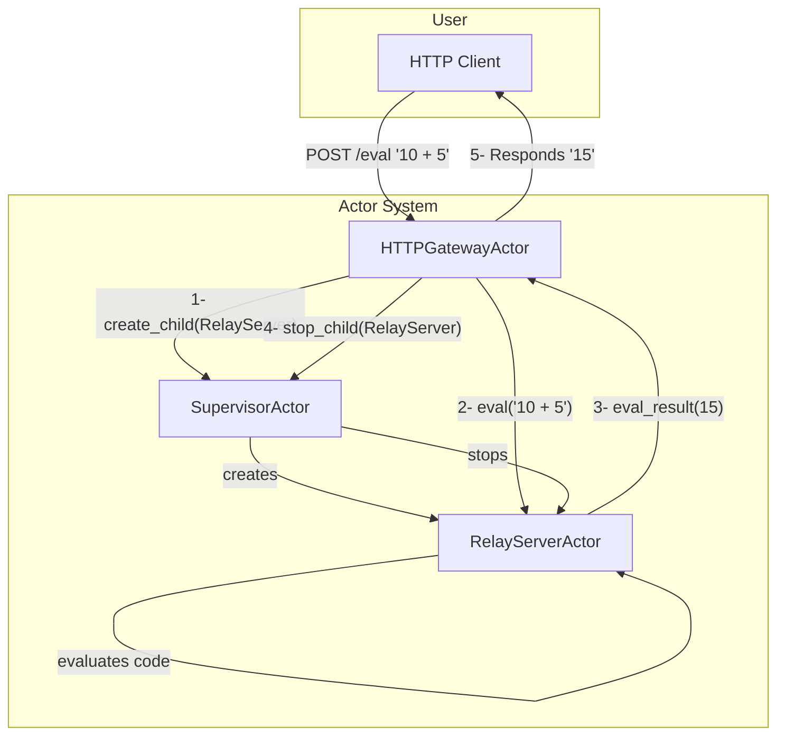
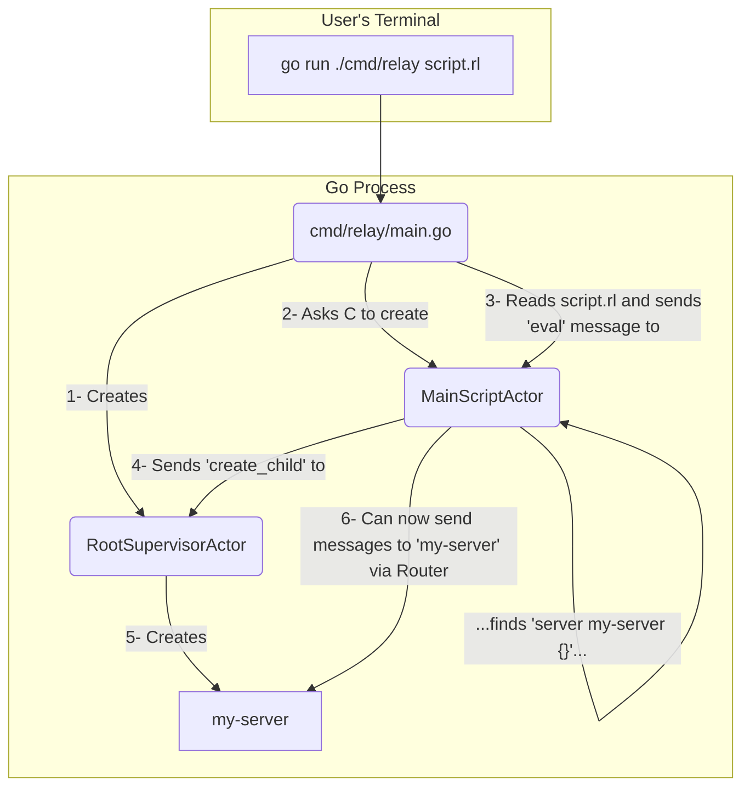

# Relay Actor-Based Architecture

This document outlines the refactored architecture of the Relay project, which is based on the Actor Model. The primary goal of this refactoring is to improve modularity, decouple components, and establish a robust foundation for concurrency.

## Core Components

The new architecture is built around a few key primitives that work together to form the system.

-   **`Actor`**: The fundamental unit of computation and state. Each actor has a unique name, a mailbox (channel) for receiving messages, and a function to process those messages. Actors communicate exclusively by sending asynchronous messages to each other.
-   **`Router`**: The central message bus for the entire system. All actors are registered with a router. When an actor sends a message to another, it is passed to the router, which then delivers it to the destination actor's mailbox.
-   **`SupervisorActor`**: A special type of actor whose sole responsibility is to manage the lifecycle of other actors (its "children"). It can start, stop, and monitor actors. This pattern is key to our dynamic, resource-managed system.
-   **`RelayServerActor`**: This actor encapsulates a complete Relay language runtime environment (`evaluator`). It holds state and executes Relay code. It is the workhorse of the application logic.
-   **`Gateway Actors`** (`HTTPGatewayActor`, `WebSocketGatewayActor`): These are actors that bridge the outside world (e.g., HTTP requests) to the internal actor system. They translate external protocols into actor messages.

## Execution Flows

There are two primary ways the Relay system can be initiated, both of which build on the same core actor components.

### 1. Gateway (Server) Mode

This mode is used when running Relay as a persistent server, listening for external connections. The `HTTPGatewayActor` serves as the entry point.

For each incoming HTTP request that needs evaluation, the following sequence occurs:

1.  The `HTTPGatewayActor` receives the request.
2.  It sends a `create_child` message to the `SupervisorActor` to spawn a new, temporary `RelayServerActor` for this specific request.
3.  The Gateway sends an `eval` message (containing the code from the request body) to the newly created `RelayServerActor`.
4.  The `RelayServerActor` evaluates the code and sends an `eval_result` message back to the Gateway.
5.  The Gateway writes the result to the HTTP response.
6.  Finally, the Gateway sends a `stop_child` message to the Supervisor to terminate the temporary `RelayServerActor`, cleaning up its resources.

This flow is illustrated below:

### 2. CLI (Script) Mode

This mode is used when executing a local Relay script from the command line, e.g., `relay script.rl`.

1.  The `main` function in `cmd/relay/main.go` bootstraps the system by creating a `Router` and a root `SupervisorActor`.
2.  It asks the supervisor to create a primary `RelayServerActor` to execute the script.
3.  It reads `script.rl` and sends its contents in an `eval` message to the primary actor.
4.  When the evaluator (inside the primary actor) encounters a `server my-server { ... }` declaration, it does **not** create a server itself. Instead, it sends a `create_child` message for `my-server` to its supervisor.
5.  The supervisor creates a new `RelayServerActor` named `my-server`, making it a sibling to the main script-running actor.
6.  From this point, the main script can communicate with `my-server` by sending messages through the router, achieving seamless federation.

This flow is illustrated below:

