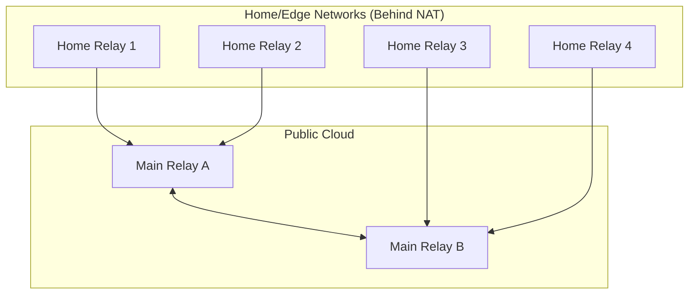
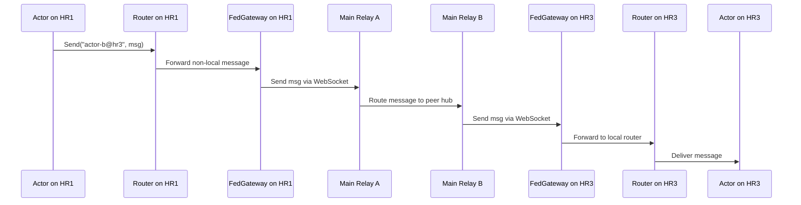

# Relay Federation Architecture - Hub-and-Spoke with Actors

## Overview

The Relay federation system uses a **hub-and-spoke model** optimized for real-world deployment. This architecture, built upon the Actor Model, enables federation between **Main Relays** (cloud-hosted hubs) and **Home Relays** (edge nodes, often behind NAT), providing a robust foundation for distributed Relay applications.

## Architecture

### From P2P Mesh to Hub-and-Spoke

The previous peer-to-peer mesh architecture has been deprecated in favor of a more practical hub-and-spoke model.

*   **Main Relays (Hubs)**: Publicly accessible nodes that act as routers and registries for the network. They are aware of other Main Relays.
*   **Home Relays (Spokes)**: Edge nodes that connect to a Main Relay. They do not need a public IP address and can operate from behind a firewall, as they only make outbound connections.



### Actor-Based Implementation

The federation system is implemented using a set of specialized actors that manage connections and message routing between nodes.

*   **`FederationGatewayActor`**: A crucial actor that runs on each node.
    *   On a **Home Relay**, it establishes and maintains a persistent WebSocket connection to its designated Main Relay.
    *   On a **Main Relay**, it listens for incoming WebSocket connections from Home Relays and other Main Relays.
    *   It is responsible for serializing actor messages and sending them over the WebSocket, as well as deserializing incoming messages and forwarding them to the local `Router`.

*   **`Router` (Updated Role)**: The router's role is expanded for federation.
    *   When an actor sends a message (e.g., `router.Send(msg)`), the router first checks if the recipient actor exists locally.
    *   If the recipient is **not local**, the router forwards the message to the `FederationGatewayActor`. The name of the target actor is expected to be a fully qualified address (e.g., `alice.home@relay.example.com`).

*   **`FederationRegistryActor`**: An actor that runs on Main Relays.
    *   It maintains a mapping of all known actors in the federation to the node they reside on.
    *   When a Home Relay connects, it sends a list of its public-facing actors to the registry.
    *   This allows any node in the federation to discover and send messages to any other federated actor without knowing its physical location beforehand.

### Federated Message Flow (Example)

Here is the sequence of events when an actor on `Home Relay 1` sends a message to an actor on `Home Relay 3`:



This flow demonstrates how the actor model seamlessly extends across the network, abstracting the underlying complexity of NAT traversal and service discovery.

### Design Rationale: Specialized Actors

A natural question is whether to reuse existing actors like `WebSocketGatewayActor` and `SupervisorActor` for federation. While reusing code is often a good practice, in this case, specialized actors are necessary for a clean and maintainable architecture.

*   **`FederationGatewayActor` vs. `WebSocketGatewayActor`**:
    *   The `WebSocketGatewayActor` is a **client-facing gateway**. It translates a specific application protocol (like JSON-RPC) from untrusted clients (e.g., a web browser) into internal actor messages.
    *   The `FederationGatewayActor` is a **server-to-server gateway**. It manages persistent, trusted connections to other Relay nodes and is only responsible for serializing and deserializing internal `ActorMsg` structs.
    *   Combining these different responsibilities would violate the Single Responsibility Principle and lead to a complex, insecure implementation.

*   **`FederationRegistryActor` vs. `SupervisorActor`**:
    *   The `SupervisorActor` is a **local process manager**. Its sole job is managing the lifecycle of actors on its own node.
    *   The `FederationRegistryActor` is a **global service discovery mechanism**. It maps public actor names to the nodes where they reside across the entire federation.
    *   Merging global service discovery with local lifecycle management would overload the supervisor's responsibilities and create tight coupling between local and distributed concerns.

Therefore, creating new, specialized actors for these distinct roles is the most robust and maintainable approach.

### HTTP API Endpoints

The API is simplified to focus on peer management and federation health.

**Main Relays:**
- `GET /federation/peers`: List of connected peer Main Relays.
- `POST /federation/peers/add`: Add a new Main Relay peer.
- `GET /federation/registry`: View all federated actors and their locations.
- `GET /federation/health`: Check the health of the federation links.

**Home Relays:**
- `GET /health`: Local health check.
- `GET /status`: Connection status to the Main Relay.

## CLI Integration (Updated)

The command-line interface is updated to reflect the new node types and connection methods.

### Main Relay
To start a node as a Main Relay, you run it in server mode. To connect it to other hubs, you provide a list of peer URLs.

```bash
# Start Main Relay A
./relay -server -node-id relay-a.com -port 8080

# Start Main Relay B and peer it with A
./relay -server -node-id relay-b.com -port 8081 -peers ws://relay-a.com:8080/federate
```

### Home Relay
To start a node as a Home Relay, you run a script and tell it which Main Relay to connect to.

```bash
# Start a Home Relay and connect it to Main Relay A
./relay my_app.rl -connect ws://relay-a.com:8080/federate -node-id my-home-relay
```

## Security Model

The security model remains focused on securing the connections between nodes.

- **Transport Security**: All federation traffic between gateways **must** be over TLS (WSS).
- **Authentication**:
    - Home Relays authenticate to Main Relays using a pre-shared key or token.
    - Main Relays authenticate with each other using mutual TLS (mTLS).
- **Authorization**:
    - Main Relays can maintain an access control list (ACL) of which Home Relays are allowed to connect.
    - An actor can decide whether it is "public" (federated) or "private" (local only). Only public actors are registered with the federation.

## Migration and Implementation Steps

1.  **Implement `FederationGatewayActor`**: Create the new actor responsible for managing WebSocket connections.
2.  **Update `Router`**: Add the logic to the existing `Router` to forward non-local messages to the gateway.
3.  **Implement `FederationRegistryActor`**: Create the actor for service discovery on the Main Relays.
4.  **Update CLI**: Adapt `cmd/relay/main.go` to support the new `-peers` and `-connect` flags for configuring federation.
5.  **Write E2E Tests**: Create a comprehensive test suite that spins up a multi-node topology (e.g., two hubs and a spoke) and verifies that messages are routed correctly between them.

This updated plan provides a clear path forward for building a robust and scalable federation system using the new actor-based architecture.